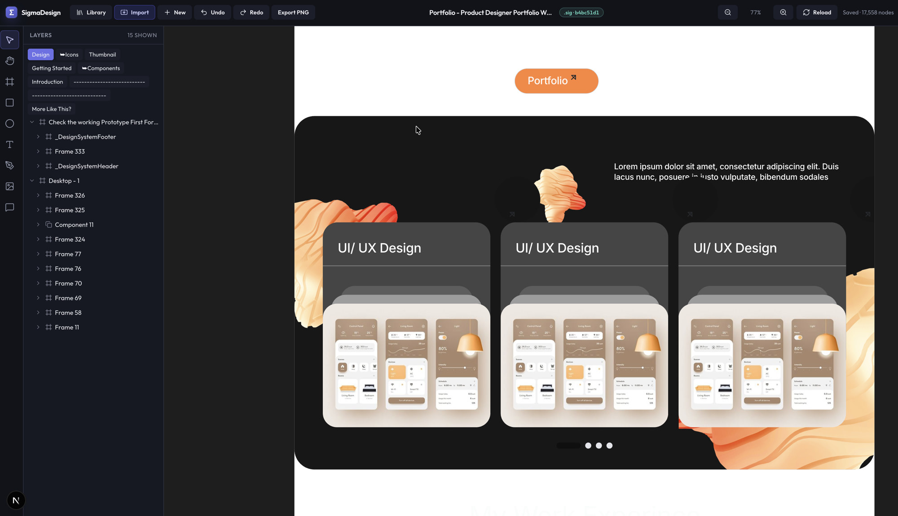
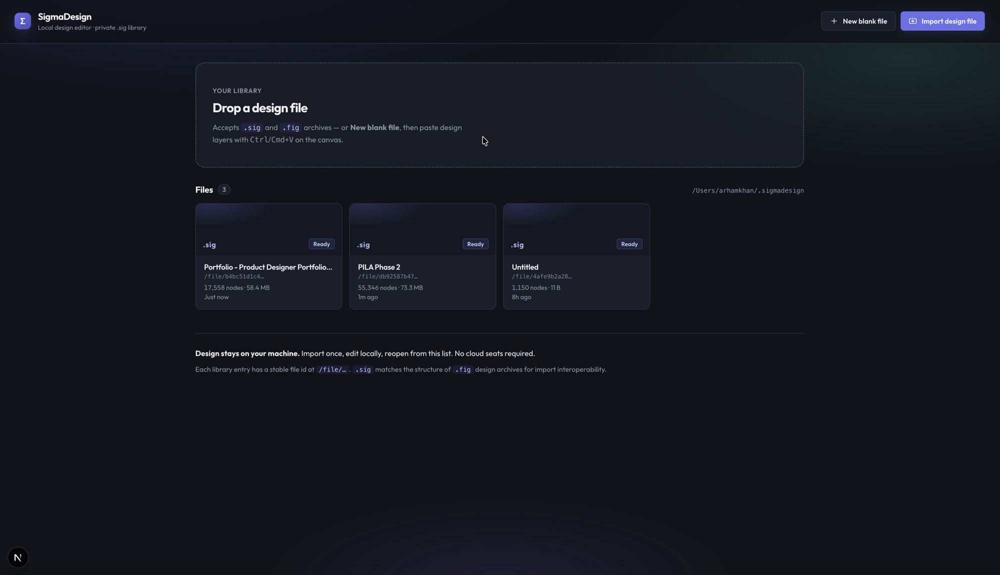
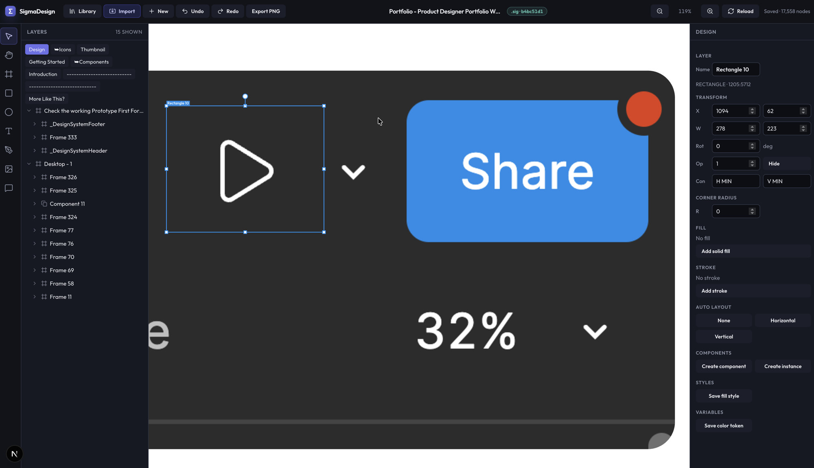

# SigmaDesign

**Local-first design editor.** Import a design archive once, keep it as **`.sig`** on your machine, and reopen anytime — no cloud seats, no accounts required for the core workflow.

<p align="center">
  
</p>

<p align="center">
  <a href="#quick-start"></a>
  <a href="https://github.com/arhamtalkstech/sigmadesign"></a>
  
  
  
</p>

---

## Why SigmaDesign

| | |
| --- | --- |
| **Local-first** | Library, session, and caches live under `~/.sigmadesign` (configurable). |
| **Import once** | Decode → expand components → open from disk in milliseconds. |
| **High-fidelity canvas** | Vectors, icons, images, text, shadows, blend modes. |
| **Authoring tools** | Frames, shapes, pen, resize/rotate, snap, booleans, auto layout. |
| **Own your files** | `.sig` library format; still imports compatible `.fig` archives. |

---

## Screenshots

| Library home | Canvas | Design panel |
| :----------: | :----: | :----------: |
|  |  |  |
| Private local library — drop `.sig` / `.fig` or create a blank file | High-fidelity scene with layers, tools, and auto-save | Transform, fill, stroke, components, styles, variables |

<p align="center">
  
</p>

<p align="center">
  
</p>

---

## Features

- **Import** design archives (`.fig` / `.sig`) into a private library with stable `/file/{id}` URLs  
- **Canvas** with pan, zoom, hit-testing, selection handles, and resize / rotate  
- **Tools** — move, hand, frame, rectangle, ellipse, text, pen, image place, comments  
- **Clipboard paste** from design tools (with warning when image bytes are missing)  
- **Auto-save** full document writeback into self-contained `.sig` files  
- **Design system basics** — components, instances, fill styles, color variables, modes  
- **Export PNG** of the page or current selection  
- **No cloud required** for the core path  

---

## Quick start

**Requirements:** Node.js ≥ 20, [pnpm](https://pnpm.io) 9.x

```bash
pnpm install
pnpm dev
```

Open **http://localhost:3000**

```bash
# alternate port
pnpm dev:3010   # → http://localhost:3010
```

### First five minutes

1. Open `/` — your library home  
2. **Import design file** (or drop a `.sig` / `.fig`)  
3. Land on `/file/{id}` — layers, canvas, design panel  
4. Pan (space + drag / scroll), zoom (ctrl + wheel), select and edit  
5. Return home via the brand control in the top bar  

More detail: **[docs/USAGE.md](./docs/USAGE.md)**

---

## Routes

| Path | Purpose |
| --- | --- |
| `/` | Library list only (never the canvas) |
| `/file/{id}` | Editor for library file `id` |
| `/?resume=1` | Reopen last file from SQLite |

---

## Local data

```text
~/.sigmadesign/              # or $SIGMADESIGN_HOME
  sigmadesign.db             # SQLite: files, viewport, last opened
  library/
    {id}.sig                 # design files
  cache/
    {id}.adm.json            # decoded scene graph (versioned)
  thumbnails/                # reserved
```

Session state (viewport, page, selection, expanded layers) is saved while you work.

---

## Monorepo

```text
apps/web                   Next.js app — UI + library API + canvas
packages/document-model    Scene graph types, transforms, authoring ops
packages/fig-format        Design-archive ZIP + kiwi codec + path blobs
packages/fig-import        Archive → ADM + instance expansion + path resolve
docs/                      Usage, architecture, development, screenshots
```

Deep dives:

- [Usage](./docs/USAGE.md)  
- [Architecture](./docs/ARCHITECTURE.md)  
- [Development](./docs/DEVELOPMENT.md)  
- [Contributing](./CONTRIBUTING.md)

---

## Architecture (short)

```text
.fig / .sig  →  import once  →  ~/.sigmadesign/library/{id}.sig
                              →  SQLite metadata + session
                              →  cache/{id}.adm.json  (ADM scene graph)
                                         ↓
                              /file/{id}  canvas · layers · properties
```

**ADM** = internal scene document (nodes, paints, paths, assets).  
**Instance expansion** materializes component trees so the canvas draws real icons, menus, and buttons.  
**Render engine** uses Path2D caches, viewport culling, image decode, multi-shadow, and blend modes.

---

## Scripts

| Command | Description |
| --- | --- |
| `pnpm dev` | Dev server (port 3000) |
| `pnpm dev:3010` | Dev server (port 3010) |
| `pnpm test` | All package tests |
| `pnpm typecheck` | TypeScript across workspace |
| `pnpm build` | Production build |
| `pnpm fig:inspect` | CLI inspect a design archive |

---

## File formats

| Extension | Meaning |
| --- | --- |
| **`.sig`** | SigmaDesign library file (recommended). |
| **`.fig`** | Compatible design archive; imported and stored as `.sig`. |

Archives are ZIP packages: kiwi-encoded scene graph, blobs, and `images/*` bitmaps. Edited library files may also store self-contained ADM JSON after the `SIGMABLANK` header for reliable writeback.

---

## Environment

| Variable | Description |
| --- | --- |
| `SIGMADESIGN_HOME` | Override library root (default `~/.sigmadesign`) |

Copy `.env.example` → `.env.local` if needed. **Never commit secrets.**

---

## Security & privacy

- No required third-party auth for core local use  
- Design data and SQLite stay on disk under `SIGMADESIGN_HOME`  
- `.gitignore` excludes `.env*`, keys, DB files, ADM caches, and runtime library data  
- Do not commit private design files or API tokens  

---

## Tests

```bash
pnpm test
```

Includes document-model authoring tests, path/geometry regression, instance-swap icons, routes/brand, UI chrome, and `.sig` writeback round-trips.

---

## License

MIT — see [LICENSE](./LICENSE).

---

## Roadmap ideas

- Thumbnails for library cards  
- Multi-page switcher UI  
- Deeper Bezier / boolean computational geometry  
- Performance profiling for 50k+ node files  
- Optional cloud sync (out of scope for core local workflow)

---

<p align="center">
  <strong>SigmaDesign</strong> — your designs, on your machine.
</p>
